# Raspberry Pi Autonomous Car

Welcome to Raspberry Pi Autonomous Car our term project for CSC 615 UNIX Programming class.

Our Task was to create a robot car with the capability to autonomously follow a track and maneuver around any obstacles on that track.

The concept behind the car was to have two line sensors, one on each side of the car to detect track and an echo sensor to detect any obstacles on the tracks.

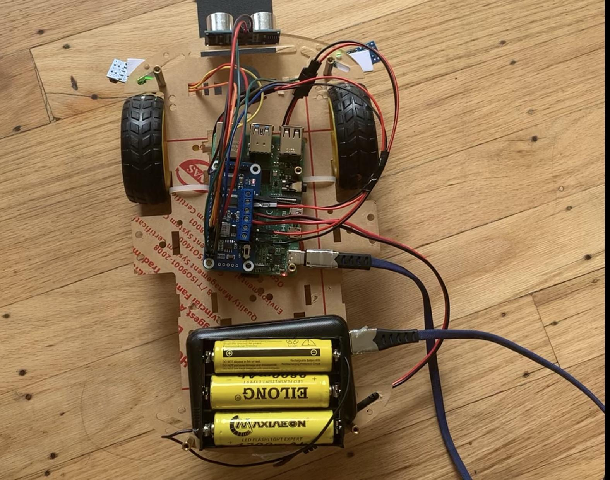
## Robot build
_______________________________________
### parts
|1. 2x TCRT5000 IR sensors | 2. 1x Ultrasonic Module HC-SR04|3. 2x motors|4. 2x wheels|5. 1x swivel caster wheel|
|---------------|-----------|-------------|-------------------|------|
|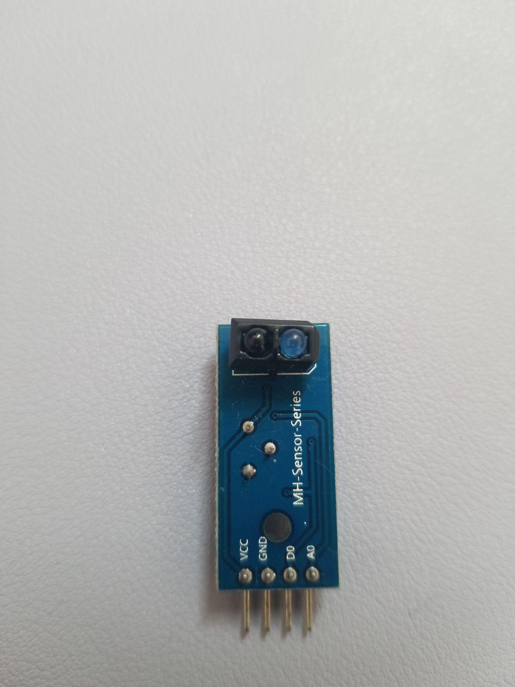|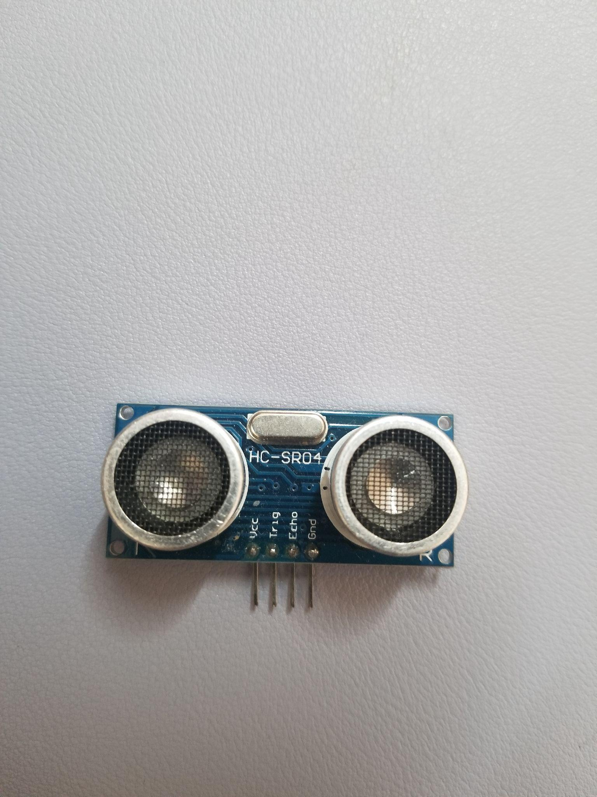|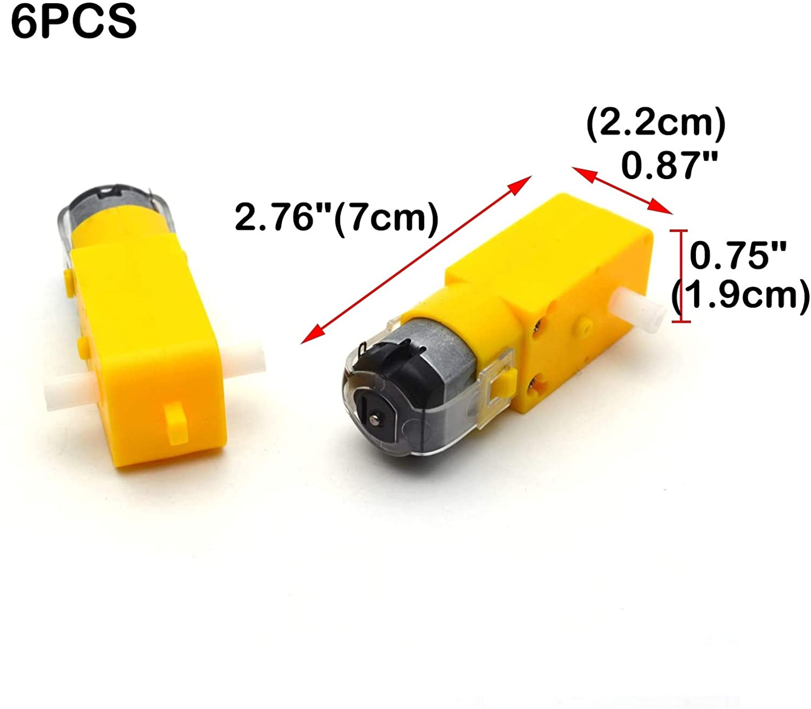|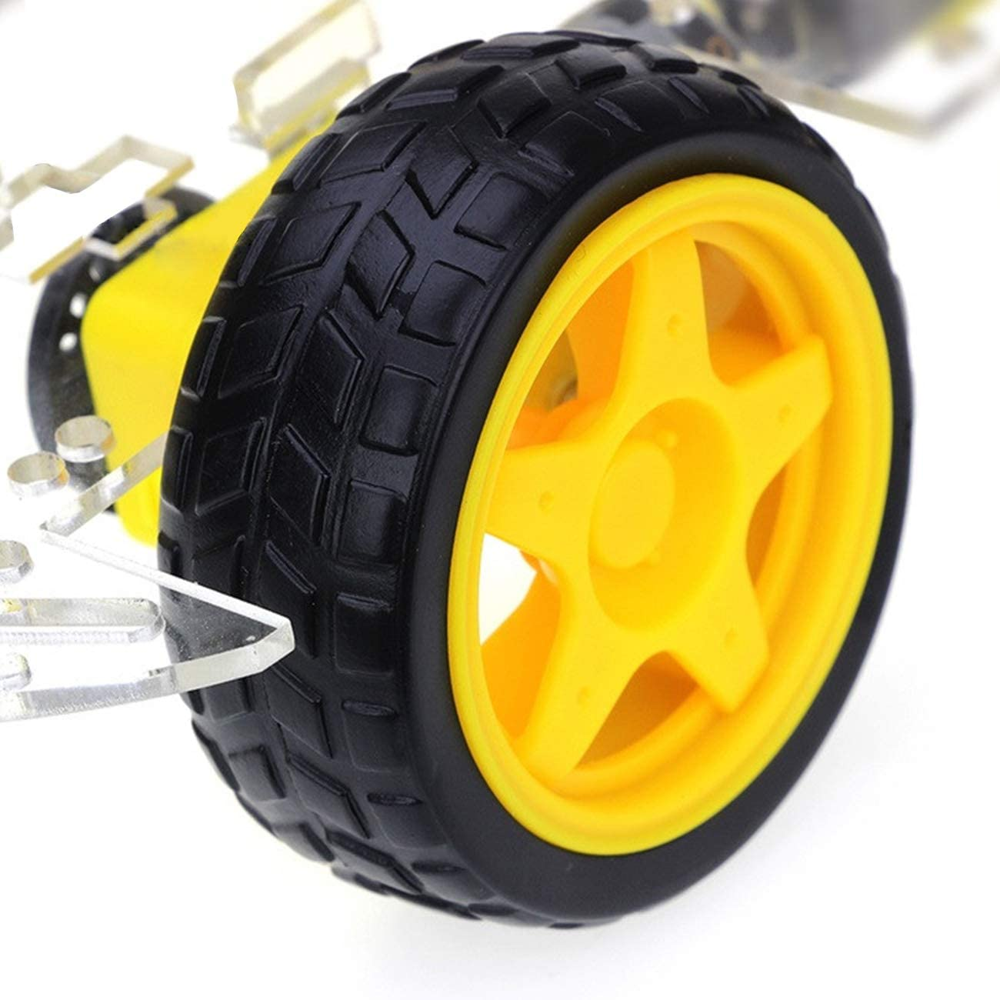|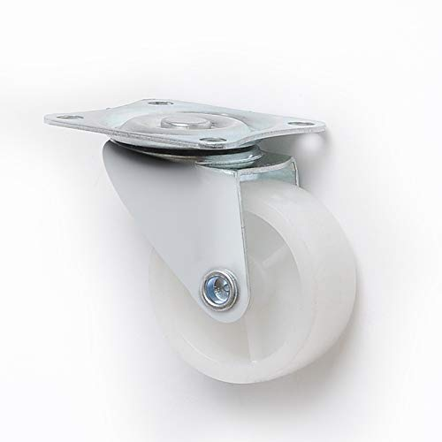|

|6. 2x chassis frame|7. 1x power bank|8. 3x 9800mAh Battery Rechargeable|9. 1x Motor Driver Hat
|-------|---------|---------|-----------|
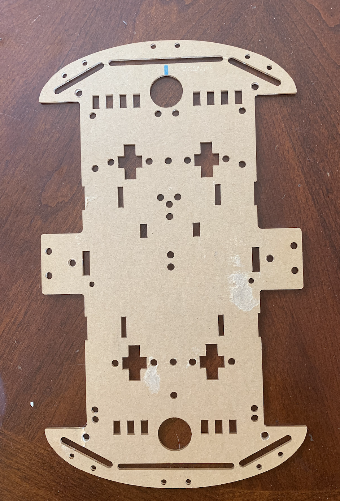|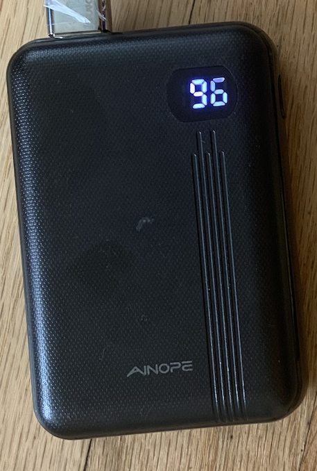|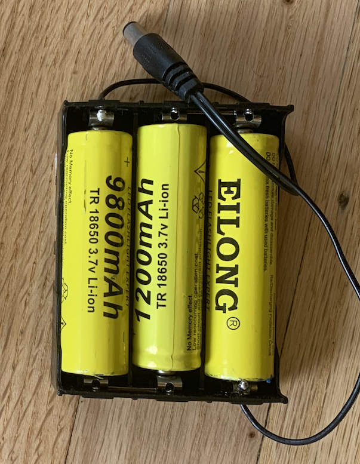|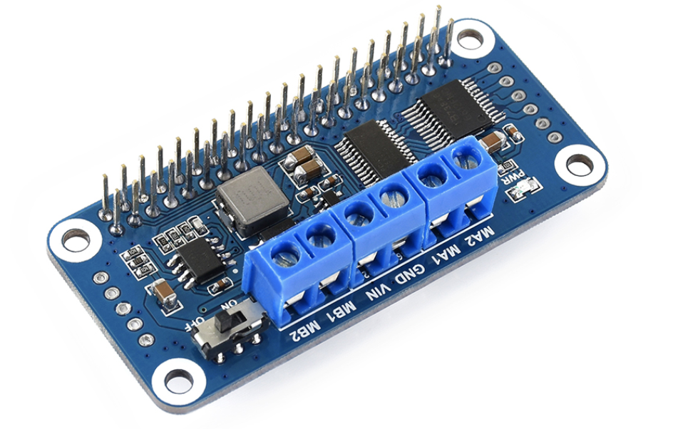|

_____________________________________
### Hardware Diagrams

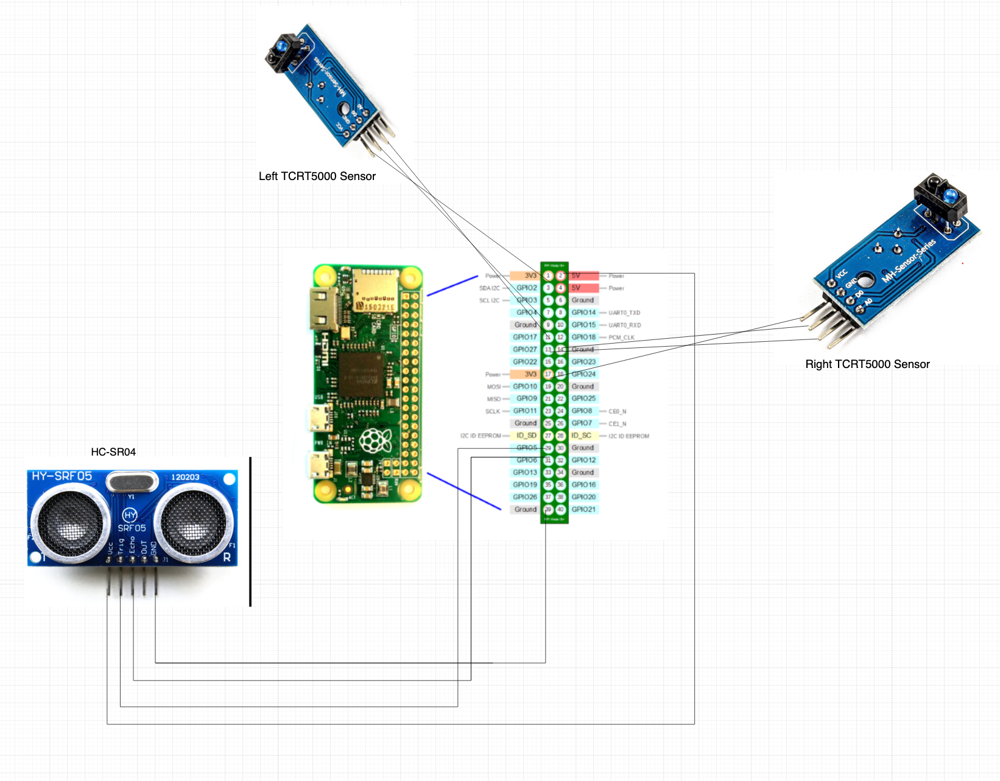
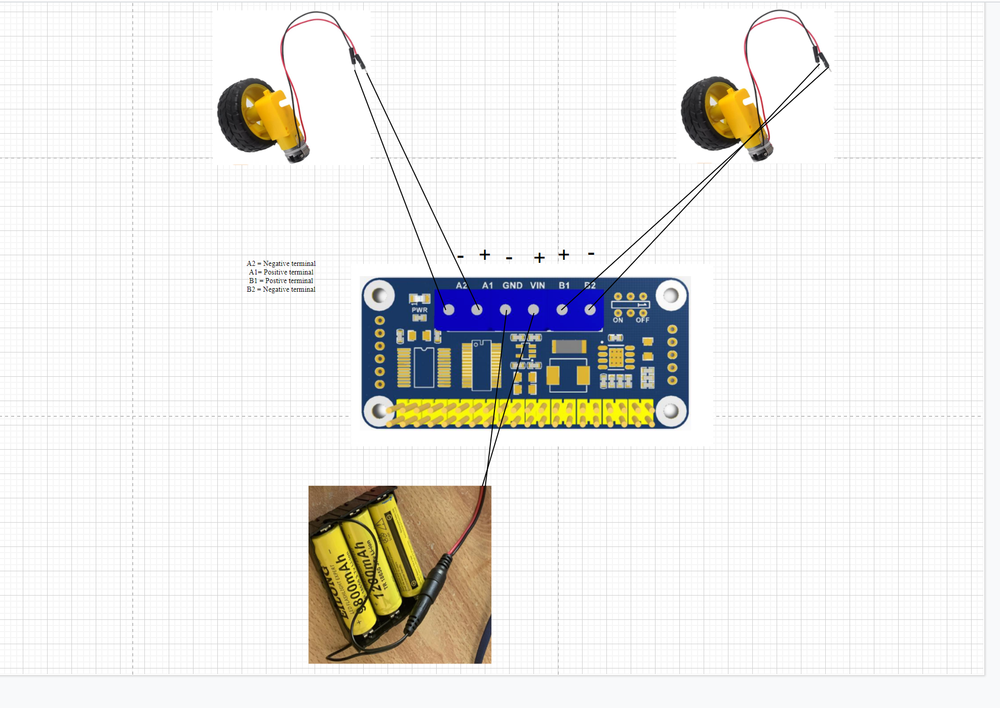
______________________________________

### GPIO pin assignments for sensors
1. HC-SR04 Sensor

|VCC|Trig|Echo|Gnd|
|----|----|----|----|
|5V power|GPIO 5 |GPIO 6 |Ground|
|physical pin 1|physical pin 29|physical pin 31|physical pin 39| 
2. Right TCRT500 Sensor

|VCC|GND|D0 |A0 |
|---|---|---|---|
|3V3 power|Ground|GPIO 27| |
|physical pin 17|physical pin 14|physical pin 13|not used

3.Left TCRT500 Sensor

|VCC|GND|D0|A0|
|---|---|---|---|
|3V3 power|Ground|GPIO 17| |
|physical pin 1|physical pin 9|physical pin 11|not used|
